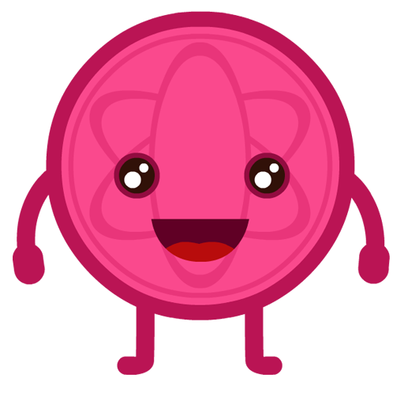
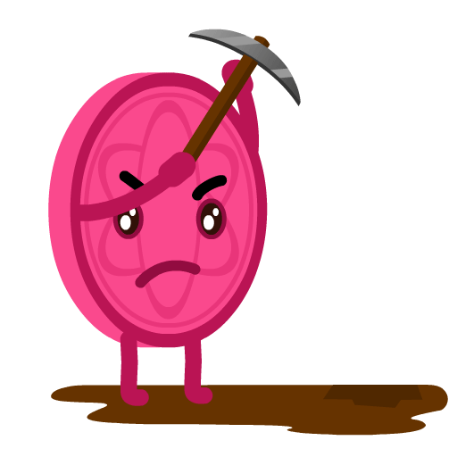
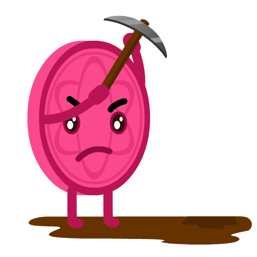
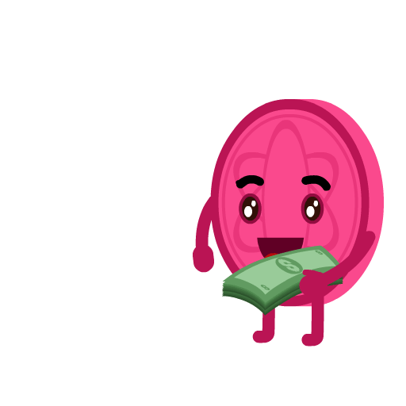
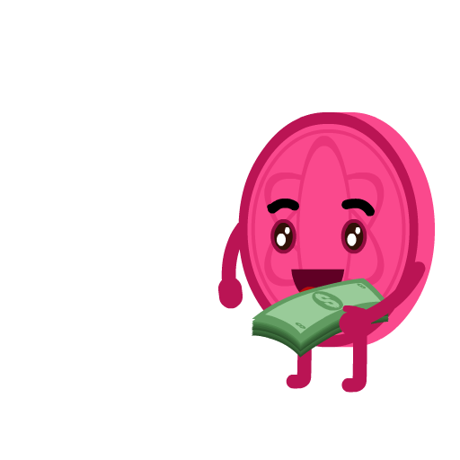
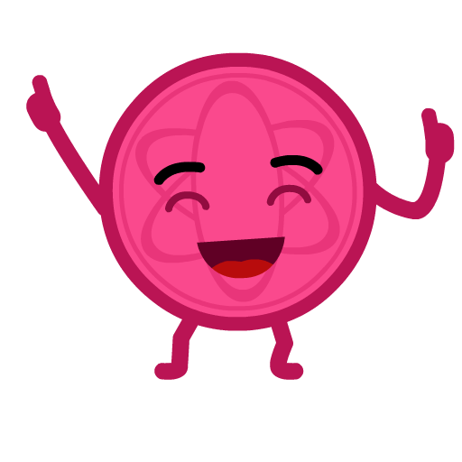
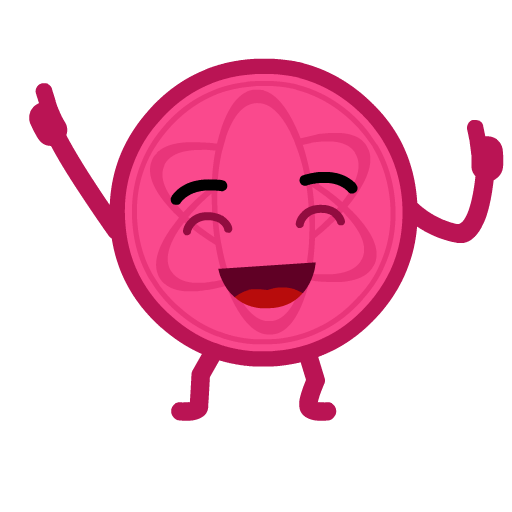
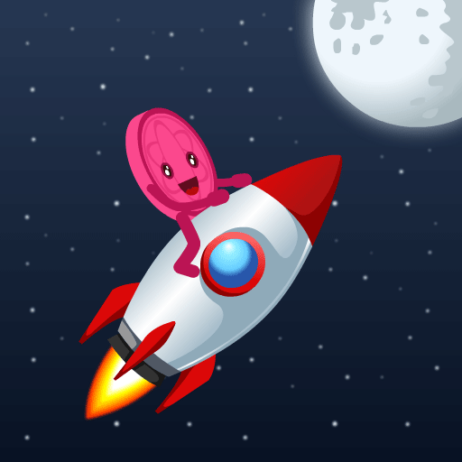
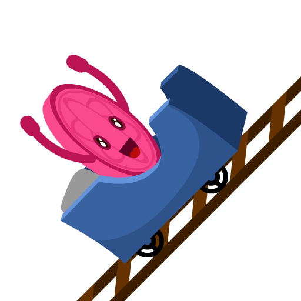
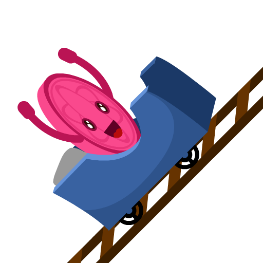

# Mascot

> A mascot is any human, animal, or object thought to represent a group with a common public identity.

## PayPay

PayPay is DePay's mascot. Originally designed by [SuRaj Renuka](https://www.behance.net/SuRajRenuka).

### Main

### HODL

### Mining

### Money

### Party

### Rocket

### Rollercoaster

