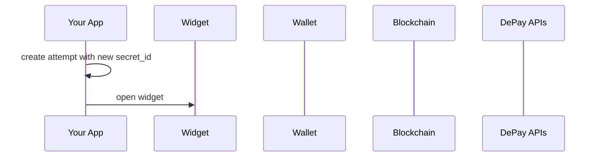

# Concepts

High-level explanation of basic Web3 Payment concepts.

## Attempt

The (payment) attempt starts as soon a user clicks something which will lead to a payment screen or opens the payment widget.

The attempt is supposed to carry the [secret_id needed to track and validate a payment](/docs/apis/payments/tracking#required-attributes).

If a payment fails, a new attempt is to be created, including assigning a new secret_id that is shared with DePay APIs.

## Trace

A trace will be recorded right before the widget hands over the payment transaction to the user's wallet.

A trace makes sure that a payment will be tracked even if the tracking of the payment fails after payment submission (to the blockchain).

## Payment

The actual payment will be tracked as soon as the user's wallet reports the submitted transaction id back to the payment widget.

## Flow

### Succesfull Payment

### Failed Payment

