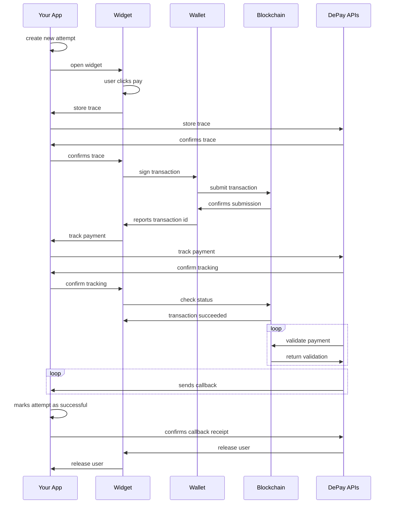
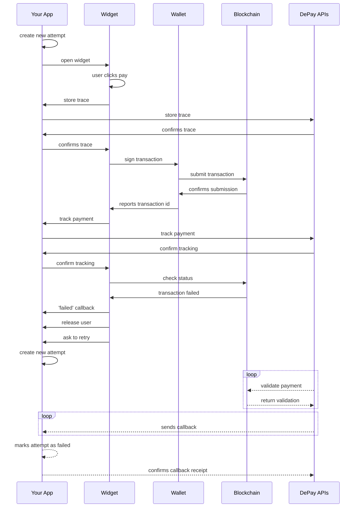

# Concepts

High-level explanation of basic Web3 Payment concepts.

## Attempt

The (payment) attempt starts as soon a user clicks something which will lead to a payment screen or opens the payment widget.

The attempt is supposed to carry the [secret_id](/docs/apis/payments/data-structure#secret_id). The [secret_id](/docs/apis/payments/data-structure#secret_id) is needed to [track and validate a payment](/docs/apis/payments/tracking#validate-requests).

Each attempt needs to have its own `secret_id`.

If a payment fails, a new attempt needs to be created, including assigning a new `secret_id` to the new attempt.

## Trace

A trace will be recorded right before the widget hands over the payment transaction to the user's wallet.

A trace makes sure that a payment will be tracked even if the tracking of the payment fails after payment submission (to the blockchain).

## Payment

The actual payment will be tracked as soon as the user's wallet reports the submitted transaction id back to the payment widget which will report it to your app which will need to send it to the DePay API.

## Flow

### Succesfull Payment

### Failed Payment

As soon as the widget detects a failed transaction it will report the failed transaction to your app via `failed` callback, shows the user a "failed transaction" screen, asks the user to retry the payment and releases the users back to your app.

Your app needs to create a new attempt with a new `secret_id` if a payment failed. Users can retry the payment without waiting for the previous payment validation to happen. None the less the failed transaction will be reported via callback, and you should change the state of that payment attempt accordingly.

