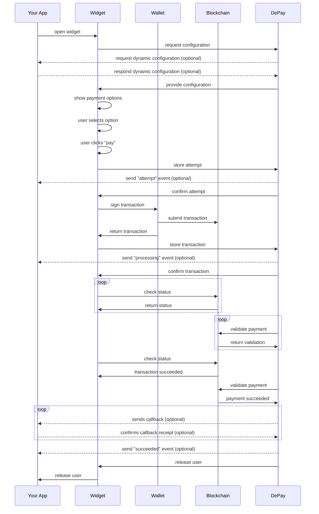
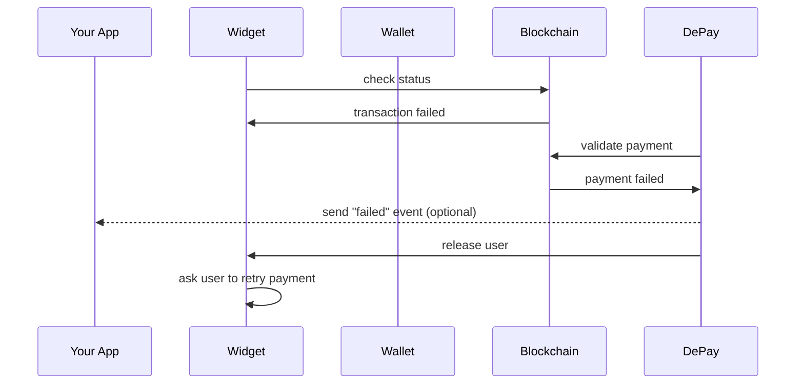

# Web3 Donation Link

Just create a link and start receiving donations.

## Example

https://donate.depay.com/1Ylujunhrm59HyLFuv7WwZ

### On Mobile


### On Desktop


## Step by step

### Create new link

Go to the DePay App on https://app.depay.com and create a Payment Link via **Links** > **New Link** and select **Donation Link**.

### Charity/Foundation

Enter a name for the charity/foundation in order to allow users to understand who is receiving the donation.

You can also upload an image to represent the charity/foundation visually.

### Cause/Project

Enter a name for the cause/project in order to allow users to understand what they are donating for.

You can also upload an image to represent the cause/project visually.

### Tokens

Configure which tokens on which blockchains you want to receive as donations.

Select as few tokens per blockchain as possible, but select at least 1 token per blockchain for every blockchain you want to support.

### Receiver

Enter the addresses that are supposed to receive the donations. One per token. You can use the same address for multiple tokens if that address supports receiving these tokens. Double-check the entered addresses, as an incorrect address can lead to a loss of donations.

### Amounts

Enter up to 3 suggested amounts that the user can select quickly to perfom a donation.

### Branding/Colors

You can select a primary color that will be used for the payment experience ensuring brand continuity throughout the payment experience.

### Collect Data

Payment Links allow you to gather the following, additional information from your users:

- Full Name
- E-Mail
- Shipping Address
- Country
- Quantity

### User Flow

Configure what is supposed to happen after a payment has been performed and validated succssfully:

- Redirect users back to you
- Show a payment confirmation without redirecting users back to you

### E-Mail Confirmations

You can configure Payment Links to automatically send payment confirmations per email after a successful payment:

- Send confirmation to your users
- Send confirmation to yourself

### Callback Request

If your systems need to be informed about incoming payments (e.g. for automation) configure a callback request.

Once the payment has been succesfully completed and validated the configured callback endpoint will receive the following request:

e.g. the configured callback endpoint is `https://example.com/payments/depay/callback`

```
POST https://example.com/payments/depay/callback
```

```javascript
{
  "status": "success",
  "failed_reason": undefined,
  "blockchain": "ethereum",
  "transaction": "0xd4a9424440f6010af1bec311dda4e23d4f0016f4cc215da84a41650150ecb8b7",
  "sender": "0x29b0d4cb9cFfEB360067199cf026dfD4854A8aB0",
  "nonce": "1",
  "receiver": "0x29b0d4cb9cFfEB360067199cf026dfD4854A8aB0",
  "token": "0xa0bEd124a09ac2Bd941b10349d8d224fe3c955eb",
  "decimals": 18,
  "commitment": "confirmed",
  "confirmations": 1,
  "after_block": "13609144",
  "amount": "822.5",
  "fee_amount": undefined,
  "fee_receiver": undefined,
  "payload": {
    "link_id": "xxNdddVnbN02f0Enrav8L"
  },
  "secret_id": "74417770-e6ac-4ae8-b027-0657600d7bad",
  "callback": "https://webhook.site/74417770-e6ac-4ae8-b027-0657600d7bad",
  "release": true,
  "forward_to": "https://example.com/payments/depay/confirmation",
  "forward_on_failure": false,
  "confirmed_at": "2021-11-25T12:54:52.332Z",
  "created_at": "2021-11-25T11:17:13.833Z",
  "updated_at": "2021-11-25T12:54:52.334Z"
}
```

Other response codes but `200` will be considered a failed callback and will be retried up to 25 times over approx. 21 days.

Payment callbacks will retry failures with an exponential backoff using the formula (retry_count ** 4) + 15 + (rand(30) * (retry_count + 1)) (i.e. 15, 16, 31, 96, 271, ... seconds + a random amount of time).

#### Verify communication

On your link page on [app.depay.com](https://app.depay.com) you will find a dedicated public key once you have activated "Send callback". Store and use it in your application to verify all communication from DePay's APIs to your systems is authentic.

DePay APIs include an `x-signature` header with all requests sent to your systems.

Use that `x-signature` header together with the stored public key to verify the request is authentic.

DePay employs RSA-PSS with a salt length of 64 and SHA256 to sign request bodies. The signature is then sent base64 safe URL-encoded via the `x-signature` header.

<Tabs>

<TabItem value="javascript" label="JavaScript" default>

Use DePay's [verify-js-signature](https://github.com/DePayFi/js-verify-RSA-PSS-SHA256#functionoality) package for JavaScript & Node:

```javascript
import { verify } from '@depay/js-verify-signature'

let verified = await verify({
  signature: req.headers['x-signature'],
  data: JSON.stringify(req.body),
  publicKey,
});

if(!verified){ throw('Request was not authentic!') }
```

</TabItem>

<TabItem value="ruby" label="Ruby" default>

```ruby
public_key = OpenSSL::PKey::RSA.new(STORED_PUBLIC_KEY)
signature_decoded = Base64.urlsafe_decode64(request.headers["X-Signature"])
data = request.raw_post

verified = public_key.verify_pss(
  "SHA256",
  signature_decoded,
  data,
  salt_length: :auto,
  mgf1_hash: "SHA256"
)

raise 'Request was not authentic' unless verified
```

</TabItem>

<TabItem value="php" label="PHP" default>

```php
use phpseclib3\Crypt\RSA;
use phpseclib3\Crypt\PublicKeyLoader;

$signature = $request->get_header('x-signature');
$signature = str_replace("_","/",  $signature);
$signature = str_replace("-", "+",  $signature);
$key = PublicKeyLoader::load($public_key)->withHash('sha256')->withPadding(RSA::SIGNATURE_PSS)->withMGFHash('sha256')->withSaltLength(64);

if( !$key->verify($request->get_body(), base64_decode($signature)) ) {
  throw new Exception("Request was not authentic");
}
```

</TabItem>

<TabItem value="other" label="Other" default>

You can read up on how to verify RSA PSS signatures in other programming languages: [here](https://cloud.google.com/kms/docs/samples/kms-verify-asymmetric-signature-rsa).

</TabItem>

</Tabs>

### Form Data

Form data entered during the payment is transported via the `payload` attribute:

```javascript
{

  "payload": {

    "full_name": "Mister Smith",
    "email": "test@example.com",
    "shipping_address": "738 S. Wentworth Street, Bronx, NY 10466",
    "billing_address": "738 S. Wentworth Street, Bronx, NY 10466",
    "country": "US",
    "quantity": 5,
    "usd_value_received": 100.10,
    "custom_values": [
      { name: "Discord Name", value: "Ninja#123" },
      { name: "Age", value: 18 }
    ]

  }
}
```

### Discounts

You can add discounts to your payment link. 

Set the percentage of the applied discount and select the condition that needs to be met in order to apply the discount.

- Select **"Owns Token"** as condition in order to apply the discount to customers owning the selected token.

- Select **"Owns NFT"** as condition in order to apply the discount to customers owning the selected NFT.

### Integrate

Once you've provided all required information the app will generate a **Payment Link** that you can use.

Send your users to the link in order to perform payments as configured.

### Inject Payload Data

You can append get parameters to the generated payment link in order to inject payload data which will become part of the [payment callback request](#callback-request).

This e.g. allows you to track individual users or sessions by id throughout the payment flow.

```
https://tip.depay.com/6KFBECVsokSt0UKOAug8CI?payload[user_id]=1234567
```

or multiple parameters

```
https://tip.depay.com/6KFBECVsokSt0UKOAug8CI?payload[user_id]=1234567&payload[session_id]=89
```

Those values will reappear in the [payment callback request](#callback-request) in the following way:

```javascript
  {
    "payload": {
      "injected": {
        "user_id": 1234567,
        "session_id": 89
      }
    }
  }
```

### Forward Parameters

If you have configured a redirect as part of your link, any passed GET-paramter will be forward. This allows you to forward certain paramters to your system through the link payment.

`payload` GET-parameters will NOT be forward upon redirect. They are only used to enrich the callback payload.

#### Example

Redirect is `https://example.com?step=confirmation`

You add the following GET-parameter when sending users to the payment link:

`https://buy.depay.com/xxNdddVnbN02f0Enrav8?user=123`

Users will be redirected after successful payment to the following URL:

`https://example.com?user=123&step=confirmation`

## Finality

DePay employs two distinct confirmation levels for payment validation based on the transaction value and the underlying blockchain's characteristics.
Payments below USD $1,000 are designated as "confirmed" after a single block confirmation.
In contrast, payments valued at USD $1,000 or above receive the "finalized" status, which necessitates varying block confirmations depending on the specific blockchain in use:

For an in-depth overview, explore the [extended validation section](/docs/payments/validation#extended-validation).

## Payment flow

### Successful payment



### Failed payment

Only differs to a [successful payment](#successful-payment) in regards of the validation result and everything happening after.

Ultimately instructing the user to retry the payment.


