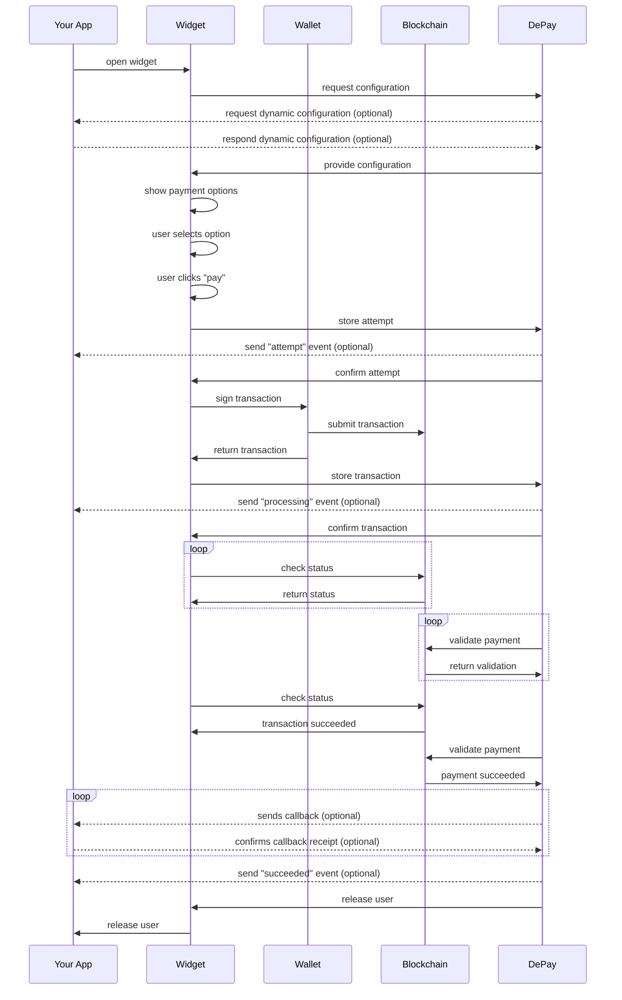
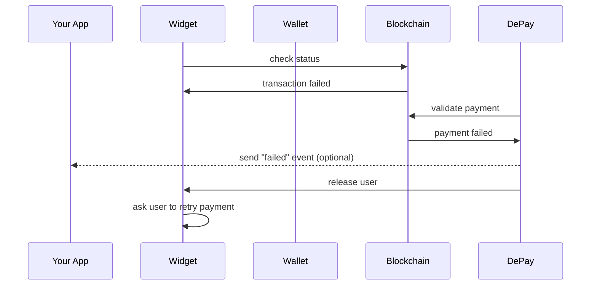

# Web3 Payment Link

Just create a link and send users to it.

## Example

https://link.depay.com/201JapngwCukZzlvdZgR1K

### On Mobile

DePay Payment Links on mobile are optimized for smaller screen sizes, ensuring a seamless user experience, and they conveniently integrate with mobile wallets, allowing customers to complete transactions with just a few taps.


### On Desktop

DePay Payment Links on desktop are designed to be visually stunning and highly intuitive, providing a straightforward payment process that boosts conversion rates. They seamlessly enable payments through crypto wallet browser extensions or by generating QR codes for easy handoff to other wallets and mobile devices.


## Step by step

### Create new link

Go to the DePay App on https://app.depay.com and create a Payment Link via **Links** > **New Link** and select **Payment Link**.


### Seller (Account)

Your account name and logo will be displayed to customers as the visual identity of your brand.


To update your account name, brand color, or logo, navigate to **Account** > **Settings** > **Branding**.


### Product

Enter a name for the product in order to allow users to understand what they are paying for.

You can also upload an image to represent the product visually.


### Description

Optionally, you can provide a description to clarify the specifics of the purchase.


### Pricing

You can denominate your product either in a fiat- or a crypto-currency.


#### Fiat Currency

If you choose to denominate your product in a fiat-currency, you will need to enter the price for the product in the selected fiat-currency.
Real-time conversion rates are calculated the moment a customer visits the link in order to pay for the product.

**Example**
> You've decided to denominate your item in USD and price it with **USD 10.00**.
> You've also configured the link to receive ETH on the Ethereum network as means of payment.
> Once a customer visits the link to perform the payment the price of ETH is 1500 USD.
> Your customer needs to pay you **0.00667 ETH**.
> Conversions are also offered and calculated in real-time.

#### Crypto Currency

If you choose to denominate your product in a crypto-currency, you will need to enter the price for the product in every crypto-currency you are accepting as means of payment.
Real-time conversion rates are calculated the moment a customer visits the link in order to pay for the product.

**Example**
> You've decided to denominate your item in crypto-currencies.
> You've configured USDC (USD Coin by Circle) and USDT (USD by Tether) as receivables.
> You price the product for **10 USDC** and **10 USDT**.
> Once a customer visits the link to perform the payment that customer needs to pay you either **10 USDC** or **10 USDT**.
> Conversions are also offered and calculated in real-time.


### Quantity

You can enable customers to adjust the quantity, allowing them to purchase your product multiple times in a single transaction.


Customers can then adjust the desired quantity themselves during checkout or payment.


### VAT

You can also enable the display of VAT on your payment links. You have the flexibility to configure the VAT rate yourself.

:::info

Make sure to set your account country in **Account** > **Settings** > **Billing** before activating the "Include VAT" option.

:::


VAT will then be shown to customers located in the same country as the service provider.

:::info

Depending on your link configuration, the following factors will determine whether VAT is displayed:

- If no address or country data collection is activated, the customer's location country, determined by IP, will be considered.

- If shipping and billing data collection is activated, the customer's selected shipping address will be considered.

- If billing data collection is activated, the customer's selected billing address will be considered.

- If country data collection is activated, the customer's selected country will be considered.

:::


### Tokens

Configure which tokens on which blockchains you want to receive as means of payment.

:::caution

We recommend to only configure 1 token per blockchain. Please ensure you select at least one token for each blockchain you intend to support for customers.

:::

:::info

Configure only the tokens you wish to receive. With auto-conversion, your customers can seamlessly pay using thousands of different tokens, ensuring flexibility and convenience for every transaction.

:::


### Receiver

Enter the addresses that are supposed to receive the payments. One per token. You can use the same address for multiple tokens if that address supports receiving these tokens.

:::caution

Double-check the entered addresses, as an incorrect address can lead to a loss of payments.

:::

:::info

You can also manage your wallets directly through your account settings (**Account** > **Settings** > **Wallets**), allowing you to select wallets easily without the need to paste addresses manually.

:::


### Branding & Colors

You can select a primary color that will be used for the payment experience ensuring brand continuity throughout the payment experience.

:::info

Payment Links will automatically inherit the branding and color settings from your account, which you can configure in **Account** > **Settings** > **Branding**.

:::


### Collect Data

Payment Links allow you to gather the following, additional information from your users:

- Full Name
- E-Mail
- Address
  - Billing address only
  - Shipping and billing address
  - Country only
- Custom Fields


#### Payload

Collected data entered during the payment is transported via the `payload` attribute of payments:

```javascript
{

  "payload": {

    "full_name": "Mister Smith",
    "email": "test@example.com",
    "shipping_address": "Mr. Peter\n738 S. Wentworth Street\nBronx, NY 10466\nUS",
    "shipping_address_data": {
      "full_name": "Mr. Peter",
      "address_line_1": "738 S. Wentworth Street",
      "postal_code": "NY 10466",
      "city": "Bronx",
      "state": "New York",
      "country": "US"
    },
    "billing_address": "Mr. Peter\n738 S. Wentworth Street\nBronx, NY 10466\nUS",
    "billing_address_data": {
      "full_name": "Mr. Peter",
      "address_line_1": "738 S. Wentworth Street",
      "postal_code": "NY 10466",
      "city": "Bronx",
      "state": "New York",
      "country": "US"
    },
    "quantity": 5,
    "custom_values": [
      { name: "Discord Name", value: "Ninja#123" },
      { name: "Age", value: 18 }
    ]

  }
}
```

#### Prefill Form Data

If you select to "Collect Data" during [link creation](#create-new-link) you can prefill all form fields with passing get parameters:

https://link.depay.com/201JapngwCukZzlvdZgR1K?name=Max%20Musterman&country=CH

`name`: The full name of the payment sender.

`email`: The email of the payment sender.

`country`: The ISO 3166-1 alpha-2 country code of the payment sender.

`quantity`: The preselected item quantity.

#### Inject Payload Data

You can append get parameters to the generated payment link in order to inject payload data which will become part of the [payment callback request](#callback-request).

This e.g. allows you to track individual users or sessions by id throughout the payment flow.

```
https://link.depay.com/6KFBECVsokSt0UKOAug8CI?payload[user_id]=1234567
```

or multiple parameters

```
https://link.depay.com/6KFBECVsokSt0UKOAug8CI?payload[user_id]=1234567&payload[session_id]=89
```

Those values will reappear in the [payment callback request](#callback-request) in the following way:

```javascript
  {
    "payload": {
      "injected": {
        "user_id": 1234567,
        "session_id": 89
      }
    }
  }
```

### Unlock Content

You can store content that will only be displayed to customers after a successful payment, such as a link to additional pay-walled content.


Customers will be informed that content will be unlocked upon payment when they open the payment link.


Once a customer completes a successful payment, the content or link will be displayed to them.


### User Flow

Configure what is supposed to happen after a payment has been performed and validated succssfully:

- Show a payment confirmation without redirecting users back to you
- Redirect users back to a website url you specify

### E-Mail Confirmations

You can configure Payment Links to automatically send payment confirmations per email after a successful payment:

- Send confirmation to your users
- Send confirmation to yourself

### Receive Callback Requests

If your systems need to be informed about incoming payments (e.g. for automation) configure a callback request.

Once the payment has been succesfully completed and validated the configured callback endpoint will receive the following request:

e.g. the configured callback endpoint is `https://example.com/payments/depay/callback`

```
POST https://example.com/payments/depay/callback
```

```javascript
{
  "status": "success",
  "failed_reason": undefined,
  "blockchain": "ethereum",
  "transaction": "0xd4a9424440f6010af1bec311dda4e23d4f0016f4cc215da84a41650150ecb8b7",
  "sender": "0x29b0d4cb9cFfEB360067199cf026dfD4854A8aB0",
  "nonce": "1",
  "receiver": "0x29b0d4cb9cFfEB360067199cf026dfD4854A8aB0",
  "token": "0xa0bEd124a09ac2Bd941b10349d8d224fe3c955eb",
  "decimals": 18,
  "commitment": "confirmed",
  "confirmations": 1,
  "after_block": "13609144",
  "amount": "822.5",
  "fee_amount": undefined,
  "fee_receiver": undefined,
  "payload": {
    "link_id": "xxNdddVnbN02f0Enrav8L"
  },
  "secret_id": "74417770-e6ac-4ae8-b027-0657600d7bad",
  "callback": "https://webhook.site/74417770-e6ac-4ae8-b027-0657600d7bad",
  "release": true,
  "forward_to": "https://example.com/payments/depay/confirmation",
  "forward_on_failure": false,
  "confirmed_at": "2021-11-25T12:54:52.332Z",
  "created_at": "2021-11-25T11:17:13.833Z",
  "updated_at": "2021-11-25T12:54:52.334Z"
}
```

Other response codes but `200` will be considered a failed callback and will be retried up to 25 times over approx. 21 days.

Payment callbacks will retry failures with an exponential backoff using the formula (retry_count ** 4) + 15 + (rand(30) * (retry_count + 1)) (i.e. 15, 16, 31, 96, 271, ... seconds + a random amount of time).

#### Verify communication

On your link page on [app.depay.com](https://app.depay.com) you will find a dedicated public key once you have activated "Send callback". Store and use it in your application to verify all communication from DePay's APIs to your systems is authentic.

DePay APIs include an `x-signature` header with all requests sent to your systems.

Use that `x-signature` header together with the stored public key to verify the request is authentic.

DePay employs RSA-PSS with a salt length of 64 and SHA256 to sign request bodies. The signature is then sent base64 safe URL-encoded via the `x-signature` header.

<Tabs>

<TabItem value="javascript" label="JavaScript" default>

Use DePay's [verify-js-signature](https://github.com/DePayFi/js-verify-RSA-PSS-SHA256#functionoality) package for JavaScript & Node:

```javascript
import { verify } from '@depay/js-verify-signature'

let verified = await verify({
  signature: req.headers['x-signature'],
  data: JSON.stringify(req.body),
  publicKey,
});

if(!verified){ throw('Request was not authentic!') }
```

</TabItem>

<TabItem value="ruby" label="Ruby" default>

```ruby
public_key = OpenSSL::PKey::RSA.new(STORED_PUBLIC_KEY)
signature_decoded = Base64.urlsafe_decode64(request.headers["X-Signature"])
data = request.raw_post

verified = public_key.verify_pss(
  "SHA256",
  signature_decoded,
  data,
  salt_length: :auto,
  mgf1_hash: "SHA256"
)

raise 'Request was not authentic' unless verified
```

</TabItem>

<TabItem value="php" label="PHP" default>

```php
use phpseclib3\Crypt\RSA;
use phpseclib3\Crypt\PublicKeyLoader;

$signature = $request->get_header('x-signature');
$signature = str_replace("_","/",  $signature);
$signature = str_replace("-", "+",  $signature);
$key = PublicKeyLoader::load($public_key)->withHash('sha256')->withPadding(RSA::SIGNATURE_PSS)->withMGFHash('sha256')->withSaltLength(64);

if( !$key->verify($request->get_body(), base64_decode($signature)) ) {
  throw new Exception("Request was not authentic");
}
```

</TabItem>

<TabItem value="other" label="Other" default>

You can read up on how to verify RSA PSS signatures in other programming languages: [here](https://cloud.google.com/kms/docs/samples/kms-verify-asymmetric-signature-rsa).

</TabItem>

</Tabs>

### Discounts

You can add discounts to your payment link. 

Set the percentage of the applied discount and select the condition that needs to be met in order to apply the discount.

- Select **"Enters Code"** as condition in order to apply the discount for customers entering the provided discount code.

- Select **"Owns Token"** as condition in order to apply the discount to customers owning the selected token.

- Select **"Owns NFT"** as condition in order to apply the discount to customers owning the selected NFT.

### Limits

#### Start Date

Enable the payment link to become active starting from a specified time. Transactions attempted before this designated start time will not be processed.

<iframe width="100%" height="315" src="https://www.youtube.com/embed/Ddo8TsYGRLI?si=HmRBuu9WcinKgdxS&amp;controls=0" title="YouTube video player" frameborder="0" allow="accelerometer; autoplay; clipboard-write; encrypted-media; gyroscope; picture-in-picture; web-share" allowfullscreen></iframe>

#### End Date

Set the payment link to expire at a specified time. Attempts to initiate payments after this deadline will be unsuccessful.

<iframe width="100%" height="315" src="https://www.youtube.com/embed/bE1e_Wis71M?si=0iKRaQqxsAHIUPYs&amp;controls=0" title="YouTube video player" frameborder="0" allow="accelerometer; autoplay; clipboard-write; encrypted-media; gyroscope; picture-in-picture; web-share" allowfullscreen></iframe>

#### Quantity

Restrict the payment link to a predefined quantity of items, ensuring that purchases cannot exceed this limit. The available quantity is dynamically displayed to all customers in real time, ensuring transparency and immediate updates on availability.

<iframe width="100%" height="315" src="https://www.youtube.com/embed/3IgKV4t3kpo?si=B5cmkYpf3U8olags&amp;controls=0" title="YouTube video player" frameborder="0" allow="accelerometer; autoplay; clipboard-write; encrypted-media; gyroscope; picture-in-picture; web-share" allowfullscreen></iframe>

### Integrate

Once you've provided all required information the app will generate a **Payment Link** that you can use.

Send your users to the link in order to perform payments as configured.

### Forward Parameters

If you have configured a redirect as part of your link, any passed GET-paramter will be forward. This allows you to forward certain paramters to your system through the link payment.

`payload` GET-parameters will NOT be forward upon redirect. They are only used to enrich the callback payload.

#### Example

Redirect is `https://example.com?step=confirmation`

You add the following GET-parameter when sending users to the payment link:

`https://link.depay.com/xxNdddVnbN02f0Enrav8?user=123`

Users will be redirected after successful payment to the following URL:

`https://example.com?user=123&step=confirmation`

## Finality

DePay employs two distinct confirmation levels for payment validation based on the transaction value and the underlying blockchain's characteristics.
Payments below USD $1,000 are designated as "confirmed" after a single block confirmation.
In contrast, payments valued at USD $1,000 or above receive the "finalized" status, which necessitates varying block confirmations depending on the specific blockchain in use:

For an in-depth overview, explore the [extended validation section](/docs/payments/validation#extended-validation).

## Payment flow

### Successful payment



### Failed payment

Only differs to a [successful payment](#successful-payment) in regards of the validation result and everything happening after.

Ultimately instructing the user to retry the payment.


