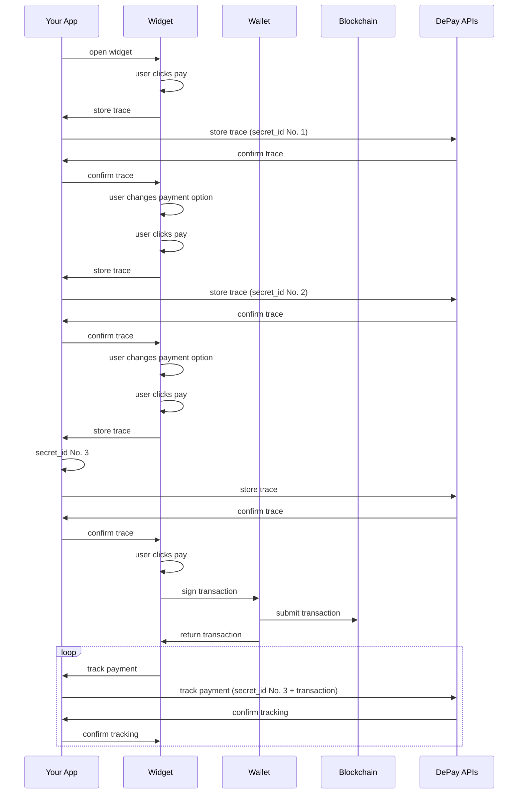
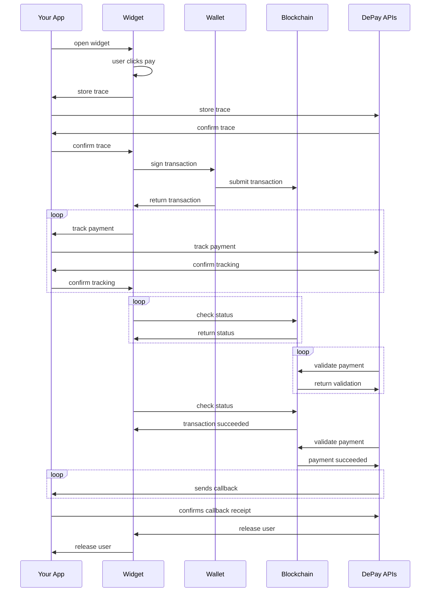
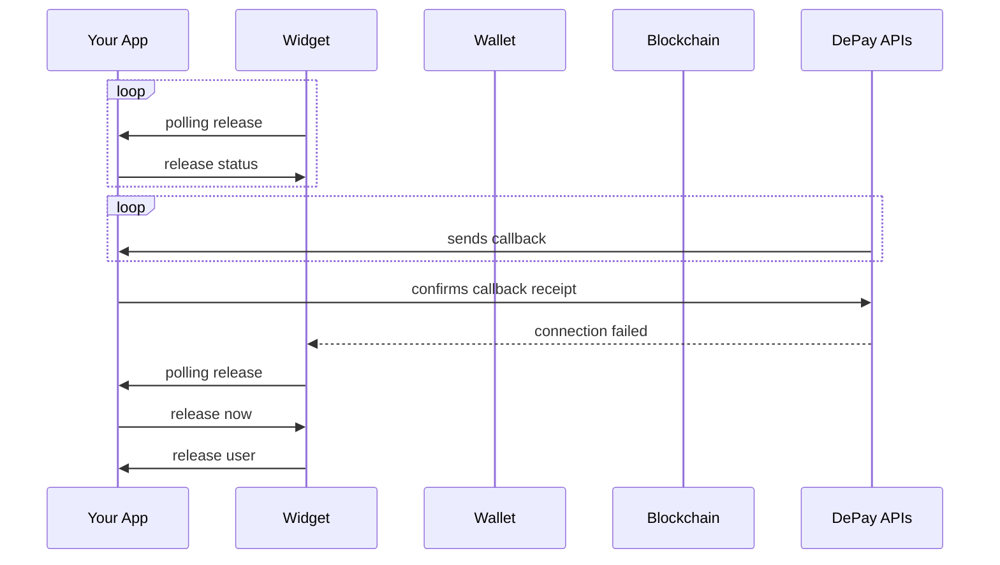
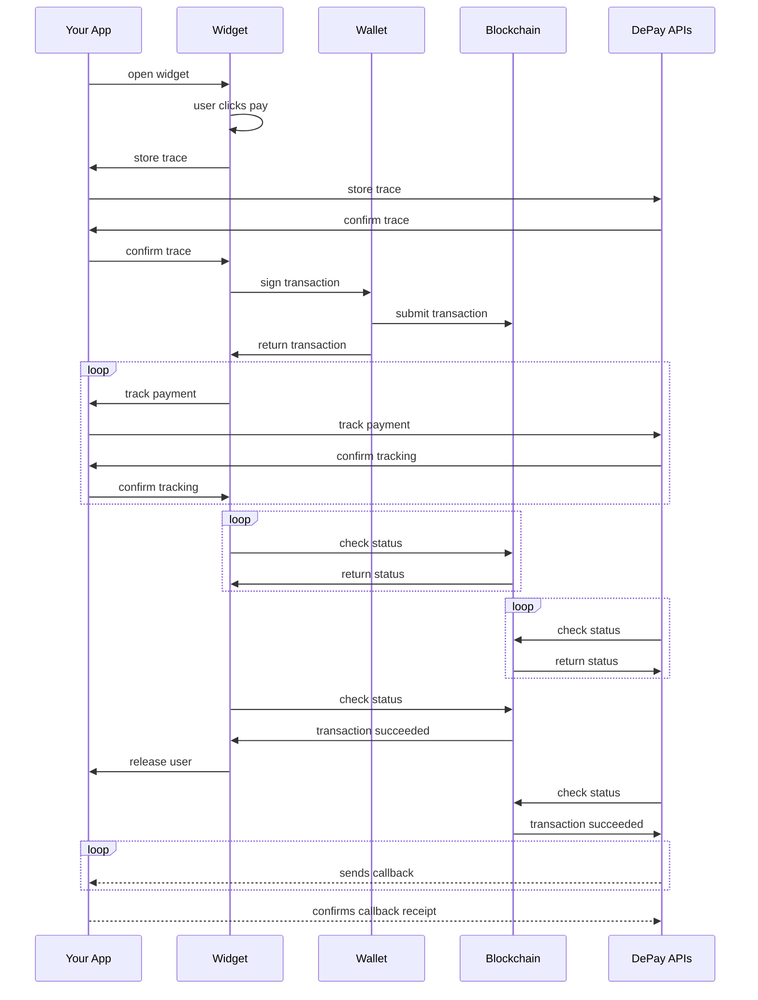
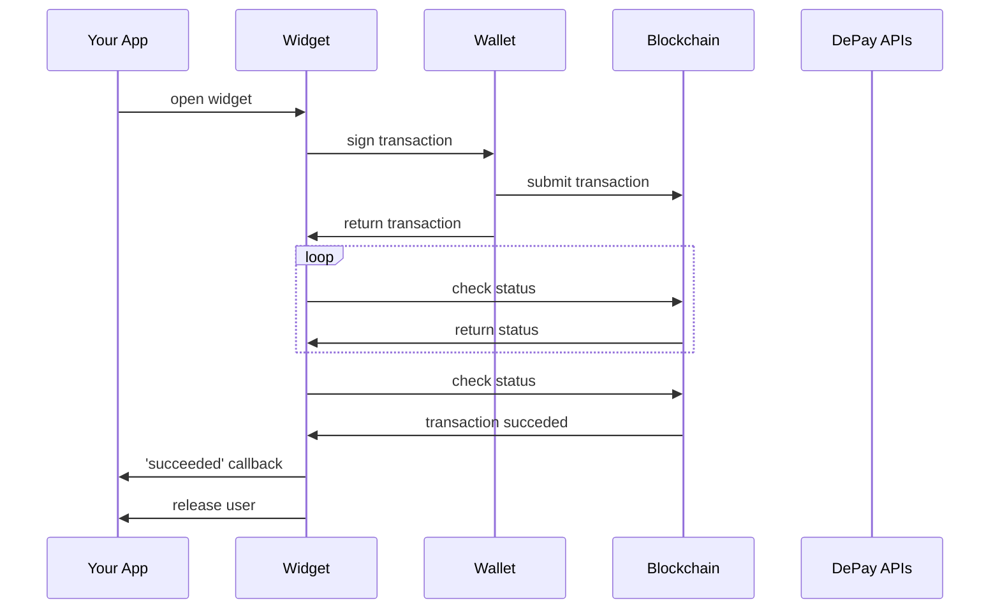
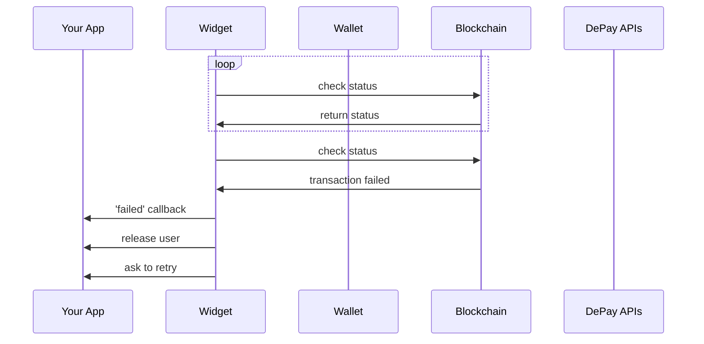

# Web3 Payment Widget

Self-host and controll the entire payment flow within your app.

## Example

<div className="widget-example pt-3" style={{ height: "245px" }}>
  <div className="ReactDialog ReactDialogOpen">
    <div className="ReactDialogRow">
      <div className="ReactDialogCell">
        <div className="ReactDialogStack active forward">
          <div className="ReactDialogStackRow">
            <div className="ReactDialogStackCell">
              <div className="ReactDialogAnimation">
                <div className="Dialog">
                  <div className="DialogHeader">
                    <div className="DialogHeaderTitle">
                      <div className="PaddingTopS PaddingLeftM PaddingRightM">
                        <h1 className="FontSizeL TextLeft">Payment</h1>
                      </div>
                    </div>
                    <div className="DialogHeaderActionRight PaddingTopS PaddingLeftS PaddingRightS">
                      <button className="ButtonCircular" title="Close dialog">
                        <svg className="CloseIcon Icon" height="24" strokeLinecap="round" strokeLinejoin="round" strokeWidth="2" viewBox="0 0 24 24" width="24" xmlns="http://www.w3.org/2000/svg">
                          <line x1="18" x2="6" y1="6" y2="18"></line>
                          <line x1="6" x2="18" y1="6" y2="18"></line>
                        </svg>
                      </button>
                    </div>
                  </div>
                  <div className="DialogBody">
                    <div className="PaddingTopS PaddingLeftM PaddingRightM PaddingBottomXS">
                      <div className="Card" title="Change payment">
                        <div className="CardImage">
                          
                        </div>
                        <div className="CardBody">
                          <div className="CardBodyWrapper">
                            <h2 className="CardText">
                              <div className="TokenAmountRow">
                                <span className="TokenSymbolCell js-widget-example-symbol">BNB</span>
                                <span className="TokenAmountCell js-widget-example-amount">0.413</span>
                              </div>
                            </h2>
                          </div>
                        </div>
                        <div className="CardAction">
                          <svg className="ChevronRight Icon" height="16" viewBox="0 0 16 16" width="16" xmlns="http://www.w3.org/2000/svg">
                            <path d="M4.646 1.646a.5.5 0 0 1 .708 0l6 6a.5.5 0 0 1 0 .708l-6 6a.5.5 0 0 1-.708-.708L10.293 8 4.646 2.354a.5.5 0 0 1 0-.708z" fillRule="evenodd" strokeWidth="1"></path>
                          </svg>
                        </div>
                      </div>
                    </div>
                  </div>
                  <div className="DialogFooter">
                    <div className="PaddingTopXS PaddingRightM PaddingLeftM PaddingBottomM">
                      <div>
                        <button className="ButtonPrimary">Pay $10.00</button>
                      </div>
                    </div>
                  </div>
                </div>
              </div>
            </div>
          </div>
        </div>
      </div>
    </div>
  </div>
</div>

<div className="pt-5 pb-1">
  <DePayButton
    label={'Click to test'}
    widget={'Payment'}
    configuration={ {"accept":[{"blockchain":"ethereum","amount":20,"token":"0xa0bEd124a09ac2Bd941b10349d8d224fe3c955eb","receiver":"0x4e260bB2b25EC6F3A59B478fCDe5eD5B8D783B02"},{"blockchain":"bsc","amount":20,"token":"0xa0bEd124a09ac2Bd941b10349d8d224fe3c955eb","receiver":"0x4e260bB2b25EC6F3A59B478fCDe5eD5B8D783B02"}]} }
  />
</div>

## Installation

### Package

You can install DePay Widgets via `yarn` or `npm` and build it as part of your application:

```
yarn add @depay/widgets
```

or if you use npm

```
npm install @depay/widgets --save
```

Make sure you install DePay widgets peer dependencies, too, in case your project does not have them installed yet:

```
yarn add ethers react react-dom
```

```
npm install ethers react react-dom --save
```

### CDN

If you don't want to install the package or don't want to build DePay Widgets as part of your application, you can also load DePay Widgets via our CDN:

```html
<script defer async src="https://integrate.depay.com/widgets/v10.js"></script>
```

## Usage

After installation, import `DePayWidgets` from `@depay/widgets` wherever you need it:

```javascript
import DePayWidgets from '@depay/widgets';
```

## Concepts

Learn about the 2 important steps for integrating the Web3 Payment Widget: Trace -> Tracking

### Trace

A trace will be recorded right before the widget hands over the payment transaction to the user's wallet.

A trace makes sure that a payment will be tracked even if there is no further payment information submitted back to your app after signing a payment transaction.

If a trace is not submitted succesfully, the widget shows an error message and will not allow the user to submit the payment to prevent untracked payments.

Each trace needs to have its own [`secret_id`](/docs/apis/payments/data-structure#secret_id).

#### Trace Example

_A user selects USDC as a payment option, clicks "Pay", the trace is submitted to your app (without a [`transaction`](/docs/apis/payments/data-structure#transaction)), and your app needs to make sure to forward the trace to the DePay API and it needs to respond with an HTTP success code (200) if creating the trace in the DePay API succeeded, otherwise it needs to reponds an error code (400-500) to the widget if creating the trace failed. Do NOT return the API body back to the widget!_

_If the user changes his mind after handing over to the wallet, e.g. cancels the transaction in his wallet prior to signing/submitting it and selects another payment option e.g. ETH a new trace will be submitted to your app, that new trace needs to have a new [`secret_id`](/docs/apis/payments/data-structure#secret_id) it can not have the previous trace [`secret_id`](/docs/apis/payments/data-structure#secret_id)_

### Tracking

As soon as the user's wallet reports the submitted [`transaction`](/docs/apis/payments/data-structure#transaction) back to the payment widget it will report it to your app which will need to send it to the DePay API with the same [`secret_id`](/docs/apis/payments/data-structure#secret_id) of the foregone trace.

Make sure to also report back to the widget if tracking the payment via the DePay API succeeded (with a HTTP status code 200) or failed (with a HTTP status code 400-500). Do NOT return the API body back to the widget!

If the payment failed, ask the user to retry the payment. The payment flow will restart, starting with a new trace and a new [`secret_id`](/docs/apis/payments/data-structure#secret_id).

#### Tracking Example

_Continuing with the previous trace example, after the user chose USDC as a payment option, he clicks "Pay" the trace gets succesfully submitted and your app returns an HTTP 200 back to the widget. The widget now hands over the payment transaction to the wallet to sign & submit it. After the wallet submitted the transaction to the blockchain, it will share the [`transaction`](/docs/apis/payments/data-structure#transaction) with the widget, which will send it to your app for tracking the payment. Make sure to submit the payment tracking including the [`transaction`](/docs/apis/payments/data-structure#transaction) and the [`secret_id`](/docs/apis/payments/data-structure#secret_id). The submitted [`secret_id`](/docs/apis/payments/data-structure#secret_id) needs to match the foregone trace's [`secret_id`](/docs/apis/payments/data-structure#secret_id)!_

_Make sure to responds with a HTTP status code 200 back to the widget if the payment tracking succeeded or with an HTTP status code 400-500 if it did not. Do NOT return the API body back to the widget!_



## Flow

Choose [normal payment tracking](/docs/payments/integrations/widget#normal-tracking) if you want the user to wait for the payment to be fully validated before a release. [Normal payment tracking](/docs/payments/integrations/widget#normal-tracking) allows users to immediately retry a payment if it [failed](#failed-payments).

Choose [async payment tracking](/docs/payments/integrations/widget#async-tracking) if you want to release the user ASAP and your user flow allows for asynchronous payment validation & confirmation. [Async payment tracking](/docs/payments/integrations/widget#async-tracking) DOES NOT allow users to immediately retry the payment if it [failed](#failed-payments). You would need to ask users to try to perform the payment again.

### Normal Tracking

During normal payment tracking, users will need to wait until the payment has been validated before being released.



#### 1. Transaction submitted (Normal Tracking)


#### 2. Transaction succeeded (Normal Tracking)


#### 3. Payment validated (Normal Tracking)


#### Polling release

In normal tracking mode your app should integrate an endpoint to poll release status. See: [polling](/docs/payments/integrations/widget#polling)

This ensures that the user is released even in scenarios where the connection between DePay APIs and the widget (websockets) fails.



### Async Tracking

During async payment tracking users will be released once the payment transaction has been confirmed once by the blockchain.

Payment validation is performed asynchronously and you can sent a payment confirmation asynchronously to the user (e.g. email, notifcation etc.).



#### 1. Transaction submitted (Async Tracking)


#### 2. Transaction confirmed (Async Tracking)


### Without Tracking

Without payment tracking, users will be released immediately after the transaction has been confirmed by the blockchain.

No payment tracking nor validation is performed through DePay APIs.



### Failed Payments

Failed payment transactions need to be retried. The widget prompts the user immediately to retry the transaction if it failed on the blockchain.




### Failed Tracing

If tracing fails, the widget will NOT hand over the transaction to the user's wallet, instead it will show an error message and the user can not perform the payment:


### Failed Tracking

If tracking fails, after retrying every 3 seconds for 2 minutes (40 attempts), the widget will show the following error messages:


Users are not released if tracking fails (even in async tracking mode).

## Configuration

You need to pass a configuration object to `DePayWidgets.Payment` which needs to at least contain the `accept` field.

```javascript
DePayWidgets.Payment({

  accept: [{
    blockchain: 'ethereum',
    amount: 20,
    token: '0xa0bEd124a09ac2Bd941b10349d8d224fe3c955eb',
    receiver: '0x4e260bB2b25EC6F3A59B478fCDe5eD5B8D783B02'
  }]
});
```

This declares to accept 20 DEPAY tokens (`0xa0bEd124a09ac2Bd941b10349d8d224fe3c955eb`) as payment on `ethereum` to `0x4e260bB2b25EC6F3A59B478fCDe5eD5B8D783B02`.

You can also accept multiple payments on multiple blockchains:

```javascript
DePayWidgets.Payment({

  accept: [
    { // 20 USDT on ethereum
      blockchain: 'ethereum',
      amount: 20,
      token: '0xdac17f958d2ee523a2206206994597c13d831ec7',
      receiver: '0x4e260bB2b25EC6F3A59B478fCDe5eD5B8D783B02'
    },{ // 20 BUSD on bsc
      blockchain: 'bsc',
      amount: 20,
      token: '0xe9e7cea3dedca5984780bafc599bd69add087d56',
      receiver: '0x552C2a5a774CcaEeC036d41c983808E3c76477e6'
    }
  ]
});
```

The [DePay App](https://app.depay.com) helps you to create a basic valid configuration: **[DePay App](https://app.depay.com)** > **Integrations** > **New Integration** > **Payment Widget**

### accept

The `accept` attribute describes what is accepted as a payment. It needs to be an array and needs to contain at least one entry.

#### Required Attributes

`blockchain` - The name of the blockchain (e.g. `ethereum`, `bsc`, `polygon` etc.)

`token` - The address of the token you want to receive

`receiver` - The address receiving the payment. Always double check that you've set the right address.

#### Optional Attributes

`amount` - The amount of tokens you want to receive. Needs to be passed as a human-readable number e.g. 20 or "20".
The BigNumber of that amount will be calculated internally including finding the right amount of decimals for the given token. Just pass the amount in a human readable form as Number/Decimal: e.g. 20 for 20 USDT or 20.25 etc.
If you do not pass an amount, the user will be able to select an amount within the widget.


### track

Allows to track and validate payments via [DePay APIs](/docs/apis).

```javascript
track: {
  endpoint: '/track/payments' // your endpoint to forward the payment tracking to the payments api
}
```

Once a user clicks "Pay" in the widget, and before the transaction is handed over to the wallet, the widget will send a payment trace (without [`transaction`](/docs/apis/payments/data-structure#transaction)) to the configured endpoint.

This is where the payment tracing starts:

```javascript
POST /track/payments
BODY:
  {
    "blockchain": "ethereum",
    "sender": "0x769794c94e9f113e357023dab73e81dbd6db201c",
    "nonce": "103",
    "after_block": "13230369",
    "to_token": "0xa0b86991c6218b36c1d19d4a2e9eb0ce3606eb48",
    "integration_id": "ef223b83-86c9-423f-9a0e-47a079d20f9d"
  }
```

If the endpoint does not confirm the receival (with `200`) the widget will not hand over the transaction to the wallet.

Make sure to forward the payment trace to the [DePay API](/docs/apis/payments/tracking).

Once the payment has been signed and submitted by the user wallet, the widget will call the configured endpoint to start the payment tracking.

This is where the payment tracking starts:

```javascript
POST /track/payments
BODY:
  {
    "blockchain": "ethereum",
    "transaction": "0x4311a9820195c2a5af99c45c72c88848ed403a4020863c913feed81d15855ae4",
    "sender": "0x769794c94e9f113e357023dab73e81dbd6db201c",
    "nonce": "103",
    "after_block": "13230369",
    "to_token": "0xa0b86991c6218b36c1d19d4a2e9eb0ce3606eb48",
    "integration_id": "ef223b83-86c9-423f-9a0e-47a079d20f9d"
  }
```

Alternatively you can pass a `method` to `track` that performs the tracking request to your backend if you need to handle the request yourself (e.g. to add additional headers etc.):

```javascript
track: {
  method: async (payment)=>{
    let response = await fetch('/track/payments', {
      method: 'POST',
      body: JSON.stringify(payment),
      headers: { "Content-Type": "application/json", "X-CSRF-TOKEN": document.querySelector('[name=csrf-token]').content }
    })
    if(response.status != 200) {
      throw 'TRACKING FAILED'
    }
  }
}
```

```javascript
track: {
  method: (payment)=>axios('/track/payments', payment)
}
```

Make sure that your `track->method` throws an error in case the tracking request was not succesful. `fetch` does NOT throw an error if a request fails. e.g. `axios` does throw an error if a request fails.

Your endpoint needs to make sure to forward the payload of the tracking request to DePay's [Payment Tracking API](/docs/apis/payments/tracking).

Also make sure to add `token`, `amount`, `confirmations` and `receiver` when forwarding the request to the [Payment Tracking API](/docs/apis/payments/tracking).
Those values are supposed to be set by your backend not the widget nor the fronted because any user could set these values to their liking otherwise, having you confirm payment amounts and tokens that you didn't intend to receive!

Make sure you read the [Payment Tracking API](/docs/apis/payments/tracking) documentation for further details on how to integrate payment tracking.

Payment tracking requests will be attempted indefinitely. After 2 minutes a warning dialog will be presented to users asking them to ensure an internet connection so that the payment tracking request can be performed.

##### async

For user flows where you can release the user immediatelly, we recommend performing payment validation asynchronously as in certain situation in can take up to multiple minutes to validate a payment:

You can configure the widget to track/validate the payment asynchronously:

```javascript
DePayWidgets.Payment({

  track: {
    endpoint: '/track',
    async: true
  }
})
```

Which will release the user right after the payment transaction has been confirmed on the user's machine.

It still tracks and validates the payment asynchronously (in the background) and calls back your endpoints as soon as it has been validated.

This allows you to release the user immediately, showing him some confirmation and reconfirming his payment in an asynchronous step (like a notification or email).

### polling

In order to ensure a 100% coverage that users are released and forwarded within your payment flow, you will need to implement polling in addition to tracking.

The `track.poll` configuration either takes an `enpoint` or a `method` (similiar to track itself).

It will use the endpoint or the method to request a release every 5 seconds.

You need to make sure to respond to this request with a status `404` in case the user is not to be released just yet (payment and processing on your side are not complete yet)
or `200` if the payment has been completed and the processing on your side is done and the user can be released and forwarded withing your payment flow.

In case you want to redirect the user to the next step in your system, the poll endpoint needs to respond with a body containing json like: `{ forward_to: 'https://example.com/next_step_url' }`.

It is not enough to rely on setting `forward_to` initially with the tracking request, you will also need to respond with `forward_to` when implementing polling
as the entire reason for polling is to cover cases where websockets fail and the initial `forward_to` can not be communicated to the client.

If you use a method for additional polling, make sure you return a promise. Polling will continue as long as you resolve this promise with anything that resolves to true:

```javascript
track: {
  poll: {
    endpoint: '/payments/status'
  }
}
```

It will continously make the following request to your endpoint:

```javascript
POST /payments/status
BODY:
  {
    "blockchain": "ethereum",
    "transaction": "0x4311a9820195c2a5af99c45c72c88848ed403a4020863c913feed81d15855ae4",
    "sender": "0x769794c94e9f113e357023dab73e81dbd6db201c",
    "nonce": "103",
    "after_block": "13230369",
    "to_token": "0xa0b86991c6218b36c1d19d4a2e9eb0ce3606eb48"
  }
```

Alternatively you can pass a `method` to `poll` that performs the tracking request to your backend if you need to handle the request yourself (e.g. to add additional headers etc.):

```javascript
track: {
  poll: {
    method: async (payment)=>{
      let response = await fetch('/payments/123/release', {
        method: 'POST',
        body: JSON.stringify(payment),
        headers: { "Content-Type": "application/json", "X-CSRF-TOKEN": document.querySelector('[name=csrf-token]').content }
      })
      if(response.status == 200) {
        let json = await response.json()
        return json // { "forward_to": "https://mywebsite.com/payments/123/confirmation" }
      }
    }
  }
}
```

```javascript
track: {
  poll: {
    method: async (payment)=>{
      let response = await axios('/payments/123/release', payment)
      return response // { "forward_to": "https://mywebsite.com/payments/123/confirmation" }
    }
  }
}
```

### connected

A callback that will be executed once the user connects a wallet.

This function will be called with the connected wallet address as the main argument:

```javascript
connected: (address)=> {
  // do something with the address
}
```

#### closed

`closed`

A function that will be called once the user closes the widget (no matter if before or after the payment).

```javascript
closed: ()=> {
  // do something if user closed the widget
}

```

### before

`before`

A function that will be called before the payment is handed over to the wallet.

Allows you to stop the payment if this methods returns false.

```javascript
before: (payment)=> {
  alert('Something went wrong')
  return false // stops payment
}
```

### sent

`sent`

A function that will be called once the payment has been sent to the network (but still needs to be mined/confirmed).

The widget will call this function with a transaction as single argument (see: [depay-web3-wallets](https://github.com/depayfi/depay-web3-wallets#transaction) for more details about the structure)

```javascript
sent: (transaction)=> {
  // called when payment transaction has been sent to the network
}
```

### succeeded

`succeeded`

A function that will be called once the payment has succeeded on the network (checked client-side).

The widget will call this function passing a transaction as single argument (see: [depay-web3-wallets](https://github.com/depayfi/depay-web3-wallets#transaction) for more details)

```javascript
succeeded: (transaction)=> {
  // called when payment transaction has been confirmed once by the network
}
```

### validated

`validated`

A function that will be called once the payment has been validated by DePay Apis (server-side).

```javascript
validated: (successful)=> {
  // successful (true or false)
}
```

### failed

`failed`

A function that will be called if the payment execution failed on the blockchain (after it has been sent/submitted).

The widget will call this function passing a transaction as single argument (see: [depay-web3-wallets](https://github.com/depayfi/depay-web3-wallets#transaction) for more details)

```javascript
failed: (transaction)=> {
  // called when payment transaction failed on the blockchain
  // handled by the widget, no need to display anything
}
```

### critical

`critical`

A function that will be called if the widget throws an critical internal error that it can't handle and display on it's own:

```javascript
critical: (error)=> {
  // render and display the error with error.toString()
}
```

### error

`error`

A function that will be called if the widget throws an non-critical internal error that it can and will handle and display on it's own:

```javascript
error: (error)=> {
  // maybe do some internal tracking with error.toString()
  // no need to display anything as widget takes care of displaying the error
}
```

### currency

Allows you to enforce displayed local currency (instead of automatically detecting it):

```javascript
{
  currency: 'USD'
}
```

### whitelist

Allows only the configured tokens to be eligible as means of payment (from the sender):

```javacript
whitelist: {
  ethereum: [
    '0xEeeeeEeeeEeEeeEeEeEeeEEEeeeeEeeeeeeeEEeE', // ETH
    '0xdac17f958d2ee523a2206206994597c13d831ec7', // USDT
    '0x6b175474e89094c44da98b954eedeac495271d0f'  // DAI
  ],
  bsc: [
    '0xEeeeeEeeeEeEeeEeEeEeeEEEeeeeEeeeeeeeEEeE', // BNB
    '0xe9e7cea3dedca5984780bafc599bd69add087d56', // BUSD
    '0x55d398326f99059ff775485246999027b3197955'  // BSC-USD
  ],
  polygon: [
    '0xEeeeeEeeeEeEeeEeEeEeeEEEeeeeEeeeeeeeEEeE', // MATIC
    '0x2791bca1f2de4661ed88a30c99a7a9449aa84174', // USDC
  ]
}
```

### blacklist

Allows to blacklist tokens so that they will not be suggested as means of payment (from the sender):

```javacript
blacklist: {
  ethereum: [
    '0x82dfDB2ec1aa6003Ed4aCBa663403D7c2127Ff67',  // akSwap
    '0x1368452Bfb5Cd127971C8DE22C58fBE89D35A6BF',  // JNTR/e
    '0xC12D1c73eE7DC3615BA4e37E4ABFdbDDFA38907E',  // KICK
  ],
  bsc: [
    '0x119e2ad8f0c85c6f61afdf0df69693028cdc10be', // Zepe
    '0xb0557906c617f0048a700758606f64b33d0c41a6', // Zepe
    '0x5190b01965b6e3d786706fd4a999978626c19880', // TheEver
    '0x68d1569d1a6968f194b4d93f8d0b416c123a599f', // AABek
    '0xa2295477a3433f1d06ba349cde9f89a8b24e7f8d', // AAX
    '0xbc6675de91e3da8eac51293ecb87c359019621cf', // AIR
    '0x5558447b06867ffebd87dd63426d61c868c45904', // BNBW
    '0x569b2cf0b745ef7fad04e8ae226251814b3395f9', // BSCTOKEN
    '0x373233a38ae21cf0c4f9de11570e7d5aa6824a1e', // ALPACA
    '0x7269163f2b060fb90101f58cf724737a2759f0bb', // PUPDOGE
    '0xb16600c510b0f323dee2cb212924d90e58864421', // FLUX
    '0x2df0b14ee90671021b016dab59f2300fb08681fa', // SAFEMOON.is
    '0xd22202d23fe7de9e3dbe11a2a88f42f4cb9507cf', // MNEB
    '0xfc646d0b564bf191b3d3adf2b620a792e485e6da', // PIZA
    '0xa58950f05fea2277d2608748412bf9f802ea4901', // WSG
    '0x12e34cdf6a031a10fe241864c32fb03a4fdad739' // FREE
  ]
}
```

### event

If set to `ifSwapped`, emits a [payment event](https://github.com/depayfi/depay-evm-router#depayrouterv1paymentevent02) if payments are routed through [router smart contract](https://github.com/depayfi/depay-evm-router).
Payments are routed through the DePayPaymentRouter if swapping tokens is required in order to perform the payment. If payments are not routed through the router, e.g. direct transfer, no event is emited if `event` is set to `ifSwapped`.

```javascript
{
  event: 'ifSwapped'
}
```

### container

Allows you to pass a container element that is supposed to contain the widget:

```javascript
{
  container: document.getElementById('my-container')
}
```

Make sure to set the css value `position: relative;` for the container element. Otherwise it can not contain the widget.

React example:

```javascript
let CustomComponentWithWidget = (props)=>{
  let container = useRef()

  useEffect(()=>{
    if(container.current) {
      DePayWidgets.Payment({ ...defaultArguments, document,
        container: container.current
      })
    }
  }, [container])

  return(
    <div ref={container} style={{ position: 'relative', border: '1px solid black', width: "600px", height: "600px" }}></div>
  )
}
```

### style

Allows you to change the style of the widget.

```javascript
{
  style: {
    colors: {
      primary: '#ffd265',
      text: '#e1b64a',
      buttonText: '#000000',
      icons: '#ffd265'
    },
    fontFamily: '"Cardo", serif !important',
    css: `
      @import url("https://fonts.googleapis.com/css2?family=Cardo:wght@400;700&display=swap");

      .ReactDialogBackground {
        background: rgba(0,0,0,0.8);
      }
    `
  }
}
```

### recover

Allows you to recover a previous made payment. E.g. useful if you need to continue to show a pending payment progress if user rearrives or reloads a page:

```javascript
{
  recover: {
    blockchain: 'ethereum',
    transaction: '0x081ae81229b2c7df586835e9e4c16aa89f8a15dc118fac31b7521477c53ed2a9',
    sender: '0x317d875ca3b9f8d14f960486c0d1d1913be74e90',
    nonce: 2865,
    afterBlock: 14088130,
    token: '0xEeeeeEeeeEeEeeEeEeEeeEEEeeeeEeeeeeeeEEeE',
    amount: 0.0001
  }
}
```

### fee

You can configure a fee which will be applied to every payment with it's own dedicated fee receiver address.

The fee will be taken from the target token and target amount (after swap, depending on your `accept` configuration).

`amount`: Either percentage (e.g. `5%`, or absolute amount as BigNumber string ('100000000000000000') or pure number (2.5)

`receiver`: The address that is supposed to receive the fee.

```javascript
{
  fee: {
    amount: '3%',
    receiver: '0x4e260bB2b25EC6F3A59B478fCDe5eD5B8D783B02'
  }
}
```

## Unmount

Allows you to unmount (the React safe way) the entire widget from the outside:

```javascript
let { unmount } = await DePayWidgets.Payment({})

unmount()
```

## Preload

To optimize initialization speed of the Payment Widget you can preload payment routes as soon as you become aware of the users wallet address.

Typically right after the users conncets his wallet, or in cases the user has his wallet already connected you can preload immediately:

```javascript
let address = '0x4aD374e0836c26BeC213a19D3e030F8b3A8AcDE4' // e.g. retrieve it right when you perform wallet connect
DePayWidgets.Payment.preload({
  account: address,
  accept: [
    {
      blockchain: 'ethereum',
      amount: 10,
      token: '0xa0bEd124a09ac2Bd941b10349d8d224fe3c955eb',
      receiver: '0x4e260bB2b25EC6F3A59B478fCDe5eD5B8D783B02'
    },{
      blockchain: 'bsc',
      amount: 10,
      token: '0xa0bEd124a09ac2Bd941b10349d8d224fe3c955eb',
      receiver: '0x4e260bB2b25EC6F3A59B478fCDe5eD5B8D783B02'
    }
  ]
});
```
